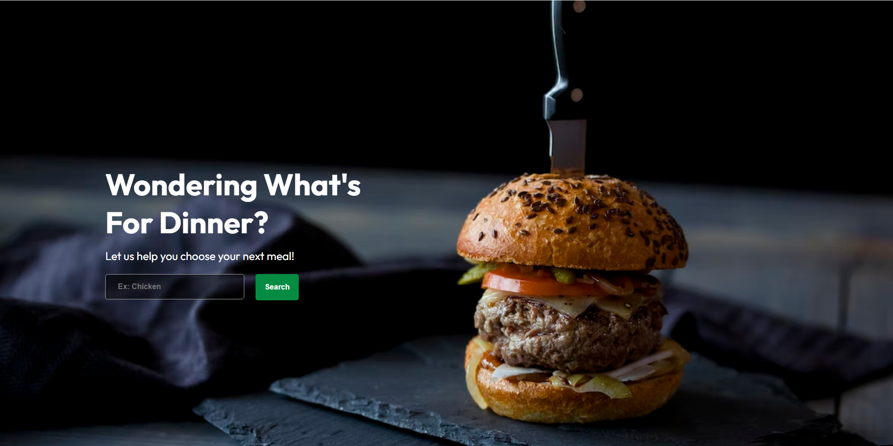

# Meal Finder
An application made to help decide the next meal for those who are indecisive!

Fun Fact: This application was inspired by me and my wifes inability to decide on what to have for dinner. 

**Link to project:** https://meal-finder-jbsl.onrender.com

## How It's Made:

**Tech used:** React, Redux, Node, Express, Material-UI, Spoontacular API

Meal Finder has 3 ways a user can go about getting recipe suggestions.

Inputting ingredients in the search bar, browsing collections of cuisines(ex: American, Chinese, etc) and randomly using the random recipe feature.

All the options provide recipes that are fetched from the Spoontacular API. Because the recipe data from each of them has a very similar format(title, url,), I was able to create one react component and utilize it multiple times to display the recipe results to the user based on the method they went about getting the recipes.

Users also have the ability to save recipes they want for later use. This was simply done using local storage. 

## Lessons Learned:
• You can use one react component to display different types of data if they share a similar format instead of making multiple files to display only one set of data. 